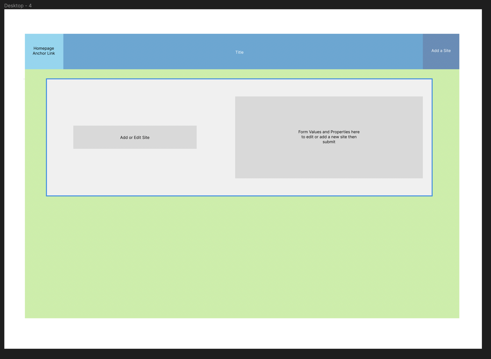

# Hawaiian Adventure Tracker APP README 

## Project Schedule

|  Day | Deliverable | Status
|---|---| ---|
|Day 1| Project Description | Complete
|Day 2| Travel Day | Complete
|Day 3| CRUD Application Routes | Complete
|Day 4| CSS Stylesheet | Complete
|Day 5| Travel Home | Complete
|Day 6| MVP Final Touches | Complete
|Day 7| Present | Incomplete

## Wireframes

## Time/Priority Matrix 

#### MVP
| Component | Priority | Estimated Time | Actual Time |
| --- | :---: |  :---: | :---: | 
| Project Preview | H | 2hr | hr |
| CRUD App Routes | H | 4hr | hr |   
| CSS Stylesheet | H | 5hr | hr| 
| Heroku Deployment | H | 2hr | hr |
| Final Touches | L | 3hr |  hr |
| Total | H | 16hrs| hrs |

#### PostMVP
| Component | Priority | Estimated Time | Actual Time |
| --- | :---: |  :---: | :---: | 
| CSS Styling Polishing | H | 4hr | hr |
| Adjusting Added Items | M | 3hr | hr |
| Total | H | 7hrs| hrs |

## Trello Board

https://trello.com/b/JzNfWRab/hawaiian-islands-adventure-sites

## Issues and Resolutions

My routes were basic and though out before getting started so I was able to complete them relatively quickly. Once I had my routes I found that styling needed extra work compared to our Portfolio Project and required additional testing. I spent most of my time getting the application to look better and ensuring that everything would display on the page accordingly.